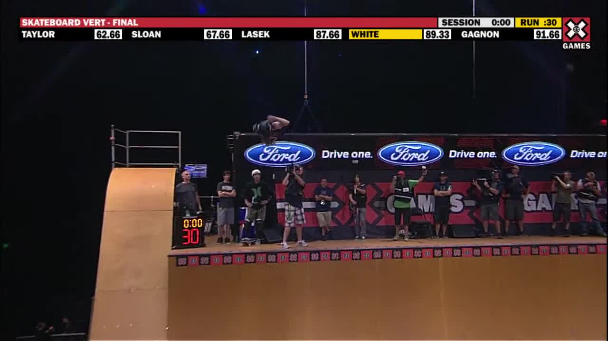
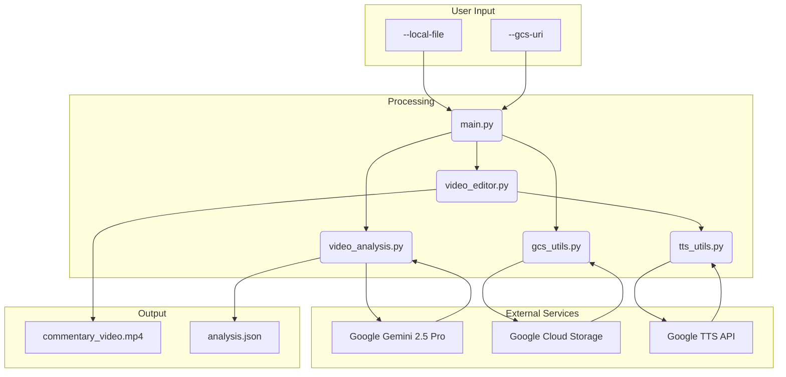

# 🛹 Half-Pipe Analysis

This project analyzes skateboarding videos from a half-pipe competition using Google's Gemini 2.5 Pro multimodal capabilities. It can analyze videos from a local file or a Google Cloud Storage (GCS) bucket identifying and analyzing tricks, scoring tricks based on official World Skate Vert Critera for judging. Lastly, it generates audio commentary and creates a new video with the commentary overlaid over the original video.

## 📂 Example Files

<table>
  <tr>
    <th>Original Video</th>
    <th>Video with Commentary</th>
    <th>Analysis JSON</th>
  </tr>
  <tr>
    <td>
      <a href="https://storage.googleapis.com/vert-analysis-examples/shaun_white.mp4" target="_blank">
        
      </a>
    </td>
    <td>
      <a href="https://storage.googleapis.com/vert-analysis-examples/shaun_white_commentary.mp4" target="_blank">
        
      </a>
    </td>
    <td>
      <a href="example_files/shaun_white_analysis.json">shaun_white_analysis.json</a>
    </td>
  </tr>
</table>

## 🏗️ Architecture



The project is structured as follows:

-   `main.py`: The entry point for the application. It handles argument parsing and orchestrates the analysis workflow.
-   `video_analysis.py`: Contains the core logic for analyzing videos with the Gemini 2.5 Pro model.
-   `video_editor.py`: Contains the logic for creating videos with commentary and score overlays.
-   `gcs_utils.py`: Provides utility functions for interacting with Google Cloud Storage, such as uploading and downloading files.
-   `tts_utils.py`: Provides utility functions for generating text-to-speech audio.
-   `extract_frames.py`: (Optional) This script can be used to extract frames from a video for separate analysis, but it is not part of the main analysis workflow.

## 🚀 Setup

1.  **Clone the repository:**

    ```bash
    git clone https://github.com/your-repo/half-pipe-analysis.git
    cd half-pipe-analysis
    ```

2.  **Create a virtual environment and install dependencies with uv:**

    ```bash
    uv venv
    source .venv/bin/activate
    uv pip install -r requirements.txt
    ```

3.  **Set up your environment variables:**

    Create a `.env` file in the root of the project and add the following variables:

    ```
    GCS_BUCKET_NAME="your-gcs-bucket-name"
    GEMINI_API_KEY="your-gemini-api-key"
    ```

    -   `GCS_BUCKET_NAME`: The name of your Google Cloud Storage bucket where videos will be uploaded.
    -   `GEMINI_API_KEY`: Your API key for the Gemini API.

## Usage

You can analyze a video from a local file or a GCS URI.

### Analyze a Local Video  المحلي

To analyze a local video file, use the `--local-file` argument:

```bash
python main.py --local-file /path/to/your/video.mp4
```

The script will upload the video to your GCS bucket and then analyze it.

### Analyze a Video from GCS ☁️

To analyze a video that is already in a GCS bucket, use the `--gcs-uri` argument:

```bash
python main.py --gcs-uri gs://your-gcs-bucket-name/videos/your-video.mp4
```

The script will download the video to a temporary local file and then analyze it.

### Flags 🚩

-   `--with-commentary`: Generate a new video with commentary.
-   `--score-overlay-only`: Generate a new video with only the final score overlay.
-   `--analyze-only`: Only generate the analysis JSON file.
-   `--clean-temp`: Remove all files from the temp directory.

### Example

```bash
python main.py --local-file sample_videos/tony_hawk_2.mp4 --with-commentary
```

## Temporary Files

All temporary files, including downloaded videos, generated audio, and analysis JSON files, are stored in the `temp` directory. This directory is not automatically cleaned up, allowing you to reuse cached files for subsequent runs.

# 📈 Next Improvements
1) Improve Trick Recognition by utlizing multi-agent reasoning
2) Fine Tune Gemini 2.5 Pro on Video Trick Recognition and Scoring
3) Export Run Results to BigQuery for analysis
4) Create Web Front End for Demos